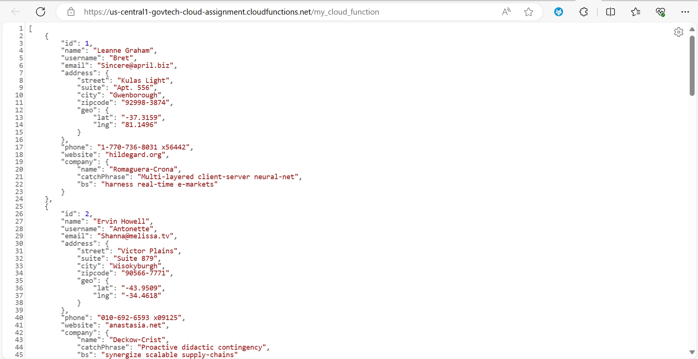
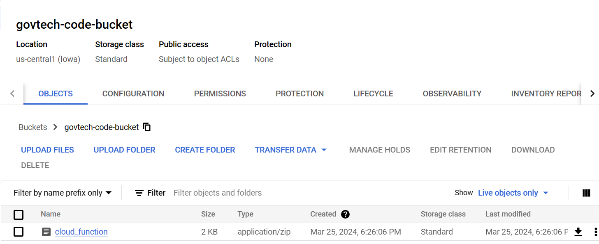
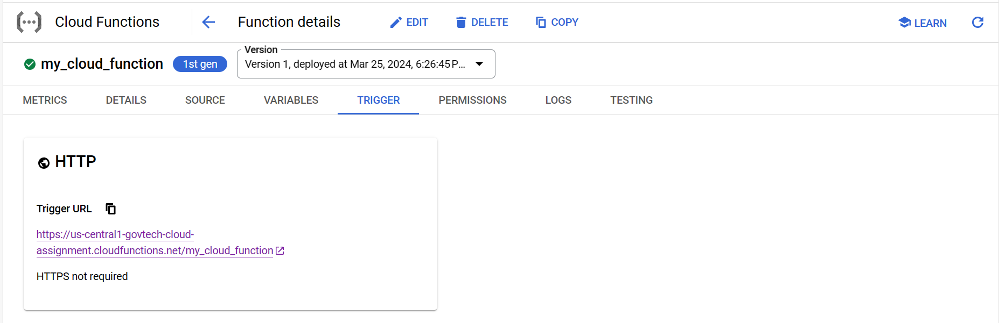

# Assessment 2: Provisioning Google Cloud Function with Terraform

This project demonstrates how to provision a simple Google Cloud Function using Terraform to return a response similar to the JSONPlaceholder API to your default virtual network in your personal Google Cloud account.



## Prerequisites

Before getting started, make sure you have the following:

- [Terraform](https://learn.hashicorp.com/tutorials/terraform/install-cli) installed on your local machine.
- A Google Cloud Platform (GCP) account and a project created.
- [Google Cloud SDK](https://cloud.google.com/sdk/docs/install) installed and authenticated with your GCP account.

## Installation

1. Clone this repository to your local machine:

   ```bash
   git clone https://github.com/your-username/assessment2.git
   cd assessment2

## Usage
1. Initialize Terraform and download the required provider plugins:

    ```bash
    terraform init

2. Update the Terraform configuration file main.tf with your Google Cloud project ID.
3. Apply the Terraform configuration to provision the Cloud Function:

    ```bash
    terraform apply

4. Access the Cloud Function URL provided in the Google Cloud Function to see the JSON response.

## Terraform Configuration
The Terraform configuration in main.tf includes the necessary resources to deploy the Cloud Function:
- `google_storage_bucket`: Creates a Cloud Storage bucket to store the Cloud Function code.
- `google_storage_bucket_object`: Uploads the Cloud Function code (function.zip compressed from function.js) to the bucket.
   
- `google_cloudfunctions_function`: Deploys the Cloud Function using the uploaded code from the bucket.
   

## Cloud Function Code
The Cloud Function code (function.js) contains the logic to return a response similar to the JSONPlaceholder API. You can modify this code as needed.

## Accessing the Cloud Function
After successfully applying the Terraform configuration, the Cloud Function will be created on GCP. You can use tools like curl or a web browser to access the function URL and view the JSON response from your Cloud Function.
